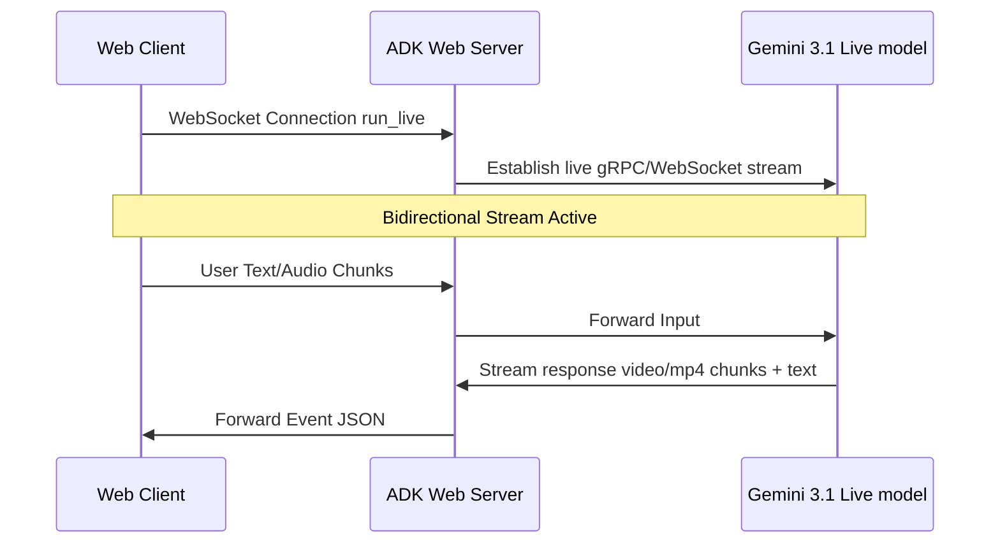

# Live Avatar Architecture: Media Buffering & Event Management
This document explains how the Gemini 3.1 Live Avatar Client (`avatar_client.html`) manages real-time media streams, WebSockets, and conversational events.

---

## 1. Event Flow Overview
The client maintains a bidirectional real-time connection using standard WebSockets.



Every message sent from the server is a JSON object containing one or more of the following components:
1. **`outputTranscription`**: Text transcripts of the model's generated audio, streamed chunk-by-chunk.
2. **`content.parts`**: Model response parts containing final text blocks, tool calls (`functionCall`), or tool execution results (`functionResponse`).
3. **`inlineData`**: Raw base64 encoded video or audio binary frames.

---

## 2. MediaSource video Buffering
To achieve smooth, real-time playback of the avatar video without page stutters, the client utilizes the HTML5 **`MediaSource`** and **`SourceBuffer`** APIs.

### The Buffer Queue Mechanism
Because video chunks arrive at a high frequency (multiple chunks per second), directly appending them to the video element causes buffer collision errors if the previous chunk is still loading. 

To prevent this, the client implements a **Buffer-and-Flush Queue**:

```
[ WebSocket Frame ] ---> [ Base64 Decode ] ---> [ Binary Uint8Array ]
                                                       |
                                                       v
                                               [ Chunk Queue ]
                                                       |
                                        (Is SourceBuffer updating?)
                                           /                 \
                                        YES                   NO
                                        /                       \
                               [ Keep in Queue ]        [ appendBuffer() ]
                                                                 |
                                                       (updateend Event Fires)
                                                                 |
                                                       [ Fetch Next Chunk ]
```

### Key Implementation Details
1. **Initializing MediaSource**:
   ```javascript
   const mediaSource = new MediaSource();
   videoElement.src = URL.createObjectURL(mediaSource);
   mediaSource.addEventListener('sourceopen', () => {
       sourceBuffer = mediaSource.addSourceBuffer('video/mp4; codecs="avc1.42E01E, mp4a.40.2"');
       sourceBuffer.addEventListener('updateend', appendNextChunk);
   });
   ```
2. **Buffering Incoming Chunks**:
   When a chunk is received:
   ```javascript
   const binaryData = base64ToUint8Array(part.inlineData.data);
   queue.push(binaryData);
   if (!isUpdating) {
       appendNextChunk();
   }
   ```
3. **Appending Chunks sequentially**:
   ```javascript
   function appendNextChunk() {
       if (queue.length === 0 || !sourceBuffer || sourceBuffer.updating) {
           isUpdating = false;
           return;
       }
       isUpdating = true;
       const chunk = queue.shift();
       sourceBuffer.appendBuffer(chunk);
   }
   ```

---

## 3. Transcript Deduplication & Synchronization
The Live API outputs both:
* **Audio Transcripts** (`outputTranscription.text`): Text generated dynamically as the voice audio plays.
* **Final Content Text** (`part.text`): The complete compiled sentence.

If both are appended directly, the chat bubble displays the text twice (e.g., *"Here are your balances. Here are your balances."*).

### Deduplication Strategy
The client tracks the active message div (`currentModelMessageDiv`) and performs a sanitized text comparison before appending any compiled text parts:

```javascript
if (part.text) {
  const cleanPart = part.text.trim().replace(/\.+$/, '');
  const cleanDiv = (currentModelMessageDiv ? currentModelMessageDiv.textContent : '').trim().replace(/\.+$/, '');
  
  if (cleanPart === cleanDiv) {
    // Discard identical text part since transcript already displayed it
  } else {
    if (currentModelMessageDiv) {
      // Overwrite the streaming transcript with the clean final text
      currentModelMessageDiv.textContent = part.text;
    } else {
      addMessage('Sky', part.text, 'model');
    }
  }
}
```

---

## 4. UI Widget Execution Order
To prevent widgets from popping up before or after the relevant conversation takes place:
1. **Tool Invocation**: The model determines a tool call is required.
2. **Direct Execution Rule**: System instructions block the model from generating pleasantries before calling the tool.
3. **Event Order**:
   - `functionCall` event is received first.
   - `functionResponse` containing tool data is received next.
   - The widget is rendered instantly (`renderWidget()`) using this data.
   - The model streams the spoken audio/text response explaining the widget.
   
This guarantees that visual assets appear on the screen exactly as the agent starts speaking about them.
